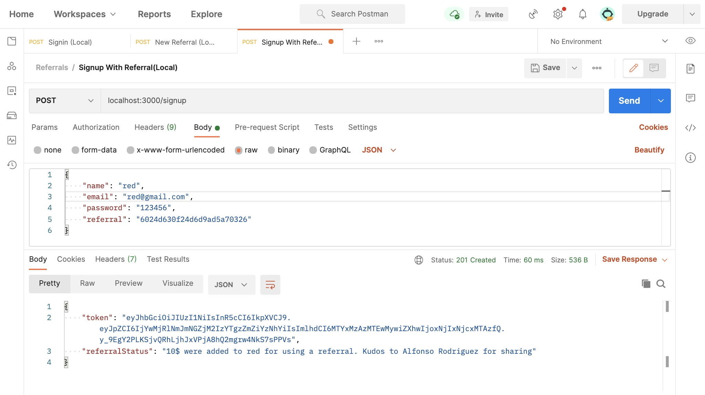

# Referral API service
> A basic referral system build with NodeJS and Mongoose

Part of a cool exercise to create a API that support the creation of a front end tha handles user referral link creations and rewarding.

The project includes a basic crud abstraction, JWT authentication, Basic tests and Schema / Model validations. 

## Local installation

After cloning the repo, go to the terminal and run *npm install* from the project directory.

A local Mongo DB Instance must be installed.

Then use a tool line Postman to test the following endpoints:

`Unprotected endpoints`

##### Sign in
POST http://localhost:3000/sigin
{
    "email": "jon@gmail.com",
    "password": "123456",
}

##### Normal Sign up
POST http://localhost:3000/signup
{
    "name": "John",
    "email": "jon@gmail.com",
    "password": "123456",
}

##### Sign up with a referral
POST http://localhost:3000/signup
{
    "name": "John",
    "email": "jon@gmail.com",
    "password": "123456",
    "referral": "131312234234"
}

The sign up with a referral ID may lead to different results:

- A successful sign up with a valid referral will add a configurable amount of credits to the registering user. If 5 conventions are reached, the creator of the referral will get a reward as well. The response contains a message about the amount added to the new user credit.
- A successful  sign up with an invalid referral code
- A successful sign up with a non ative referral link

GET http://localhost:3000/checkReferral?id=60177611cfaa9364ed850ef2

Verify if a referral ID is valid  

`Protected endpoints`

POST http://localhost:3000/api/referrals
{} 

Creates a new referral with the connected user and returns a referral link.

There are other CRUD endpoints available to interact with the models  

## Test environment

An instance of the project has been deployed to Heroku for easy testing. The root URL to the API is :

[Test environment](http://secret-woodland-86502.herokuapp.com)

``http://secret-woodland-86502.herokuapp.com``

## Source code

just in case you loose track of the original repository, here is the link to the source code at [Github](https://github.com/alfonsoluis/referrals-api)

## Postman test setup for local and cloud environments

[Postman collection](https://www.getpostman.com/collections/012ba3952a0a1deed8e8)

Keep in mind that for the secure endpoints to work. An instance of MongoDB must be configured and the local database must be set in the *dbUrl* key of `config/dev.js` file.

Also, a token must be set up for the secured endpoints and configured in the header of the requests.

## Tests

Some basic tests has been added for most of the scenarios. The available test commands are:

yarn test / Run all tests 
yarn test-routes / Test basic routing tests
yarn test-models / Tests models
yarn test-controllers / tests controller
yarn test-auth / Test unprotected endpoints
